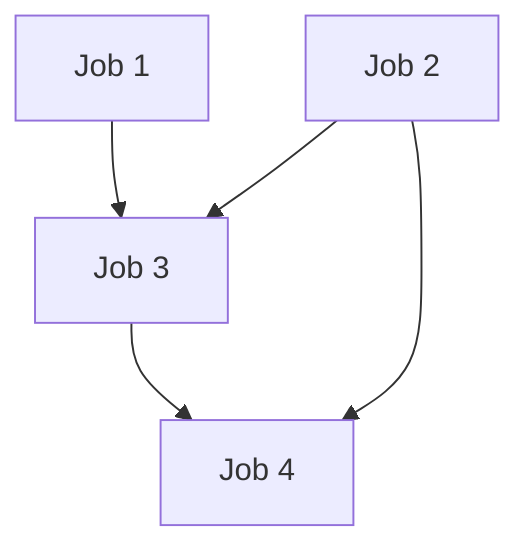

# GitHub Actions DAG (Directed Acyclic Graph) Examples

This repository demonstrates a practical example of Directed Acyclic Graph (DAG) workflow in GitHub Actions.

## Workflow Structure

The workflow consists of 4 jobs with the following dependencies:

## Job Dependencies

- `job-1` and `job-2` run independently
- `job-3` requires both `job-1` and `job-2` to complete
- `job-4` requires both `job-2` and `job-3` to complete

## Implementation Details

- All jobs run on `ubuntu-24.04`
- Each job prints start and completion messages
- Dependencies are managed using the `needs` keyword
- Workflow triggers on pushes to `main/*` branches

## Usage

1. Copy the workflow file to `.github/workflows/`
2. Push changes to a branch matching `main/*`
3. Monitor the workflow execution in GitHub Actions tab

## License

MIT
